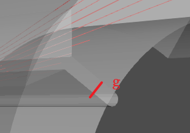
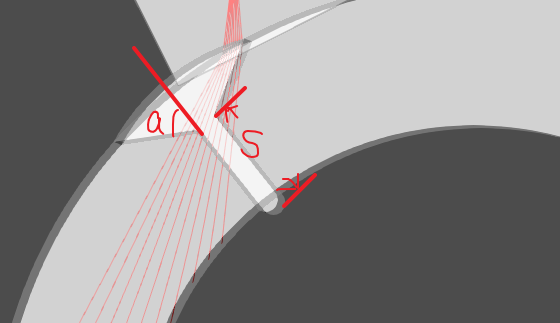
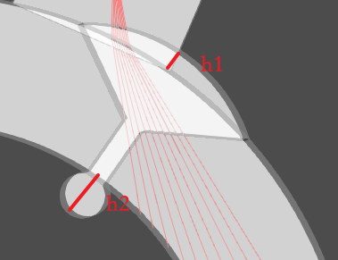

1. - `g` 默认值为 5：代表焊缝的间隙（Gap），表示在管道的扫描区域中，焊接处两侧之间的空隙。

   图上g = 5

   - `angle` 默认值为 55：代表焊缝的夹角（Angle），表示焊接处两侧之间的夹角。

   - `s` 默认值为 10：代表焊缝的长度（Length），表示焊接处在管道上的长度。

   图上a = 60,s = 15

   - `h1` 默认值为 3：代表焊缝的高度1（Height 1），表示焊接处上方一侧的高度。
   - `h2` 默认值为 2：代表焊缝的高度2（Height 2），表示焊接处下方一侧的高度。

   图上h1 = 5, h2 = 10