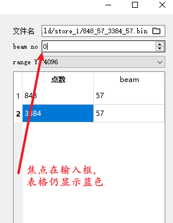

[TOC]

# *Qt常用代码*

## 添加图标

pro文件

```c++
RC_ICONS = xxx.ico
```

## render增删std::vector<vtkSmartPointer<T>>

```c++
template <typename T> void add_entity(std::vector<vtkSmartPointer<T>>& entities);
template <typename T> void remove_entity(std::vector<vtkSmartPointer<T>>& entities, bool is_clear = true);
```

```c++
template <typename T>
void Slice3dWidget::add_entity(std::vector<vtkSmartPointer<T>>& entities) {
    for (auto& entity : entities) {
        render->AddActor(entity);
    }
}

template <typename T>
void Slice3dWidget::remove_entity(std::vector<vtkSmartPointer<T>>& entities, bool is_clear) {
    for (auto& entity : entities) {
        render->RemoveActor(entity);
    }
    if (is_clear) {
        entities.clear();
    }
}
```

## Widget关闭时发送destroyed信号

```c++
this->setAttribute(Qt::WA_DeleteOnClose);
connect(this, &QObject::destroyed, this, [this]() {
    //...
});
```

## 浏览器打开目录或文件

```c++
    QFileInfo fileInfo(save_path);
    QString absolute_path = fileInfo.absoluteFilePath();
    QDesktopServices::openUrl(QUrl::fromLocalFile(absolute_path));
```

## chartview

tooltip

```c++
        m_series = new QScatterSeries();
        m_chart->addSeries(m_series);
        m_series->attachAxis(xAxis);
        m_series->attachAxis(yAxis);
        connect(m_series, &QScatterSeries::hovered, this, &ChartViewSC::showTooltip);

        tooltip = new QGraphicsSimpleTextItem(m_chart);
        tooltip->hide();
```

```c++
void showTooltip(const QPointF &point, bool state) {
        if (state) {
            tooltip->setText(QString("(%1, %2%)")
                                 .arg(point.x())
                                 .arg(QString::number(point.y() / y_end * 100, 'f', 2)));
            QPointF position = m_chart->mapToPosition(point, m_series);
            tooltip->setPos(position.x() - 40, position.y() - 40);

            tooltip->show();
        } else {
            tooltip->hide();
        }
    }
```


# *Common*

## 文件操作

### 获取该路径目录/文件

```c++
// 获取该路径下所有目录
auto list_dir = QDir(dir_chosen).entryList(QDir::Dirs | QDir::NoDotAndDotDot);
// 获取该路径下所有文件
auto list_file = QDir(dir_chosen).entryList(QDir::Files);
```

```c++
// 显示在表格中
 for (int i = 0; i < cnt_row; i++) {
        QTableWidgetItem *item = new QTableWidgetItem(dirList.at(i));
        item->setFlags(Qt::ItemIsSelectable | Qt::ItemIsEnabled);
        table->setItem(i, 0, item);
    }
```

### 如果文件(目录)不存在创建文件(目录)

```c++
// 文件
        QFile file(setting_name);
        if (!file.exists()) {
            if (file.open(QIODevice::WriteOnly)) {
                qDebug() << "File created successfully:" << setting_name;
            } else {
                qWarning() << "Failed to create file:" << setting_name;
            }
        }
// 目录
        QDir directory;
        if (!directory.exists(dir_name)) {
            if (directory.mkpath(dir_name)) {
                qDebug() << "Directory created successfully:" << dir_name;
            } else {
                qDebug() << "Failed to create directory:" << dir_name;
            }
        }
```

### 删除目录下所有文件

```c++
void remove_all_files_from(QString &dir_name) {
        auto d = QDir(dir_name);
        auto f = d.entryList(QDir::Files);
        for (auto &a : f) {
            d.remove(a);
        }
    }
```

## VTK_MODULE_INIT对应头文件

```c++
#include <vtkAutoInit.h>
VTK_MODULE_INIT(vtkRenderingContextOpenGL2);
```

## vtk交互样式

vtkStandardNewMacro一定要有, 对应头文件vtkObjectFactory.h

```c++
// h
#ifndef INSPECT_VIEW_INTERACTOR_STYLE_H
#define INSPECT_VIEW_INTERACTOR_STYLE_H

#include <vtkInteractorStyleTrackballCamera.h>
#include <vtkObjectFactory.h>

class OnlyShowTipInteractorStyle : public vtkInteractorStyleTrackballCamera {
public:
    static OnlyShowTipInteractorStyle* New();
    vtkTypeMacro(OnlyShowTipInteractorStyle, vtkInteractorStyleTrackballCamera);

    void OnMouseMove() override;
};

#endif // INSPECT_VIEW_INTERACTOR_STYLE_H

```

```c++
// cpp
#include "inspect_view_interactor_style.h"

vtkStandardNewMacro(OnlyShowTipInteractorStyle);

void OnlyShowTipInteractorStyle::OnMouseMove()
{
    vtkInteractorStyleTrackballCamera::OnMouseMove();
}

```

## 按钮点击弹出窗口

```c++
struct BoxStatus
{
    void set_ascan_widget(AscanWidgetView *w) { this->ascan_widget = w; }
    AscanWidgetView *get_ascan_widget() { return ascan_widget; }

private:
    AscanWidgetView *ascan_widget;
};
```

```c++
 box_status = std::make_shared<BoxStatus>();
```

```c++
void Inspect::on_pop_ascan_released()
{
    if (box_status->get_ascan_widget()) {
        box_status->get_ascan_widget()->showNormal();
        box_status->get_ascan_widget()->raise();
        box_status->get_ascan_widget()->activateWindow();
        return;
    }
    auto ascan_widget = new AscanWidgetView();
    box_status->set_ascan_widget(ascan_widget);
    ascan_widget->setAttribute(Qt::WA_DeleteOnClose);
    connect(ascan_widget, &QObject::destroyed, this, [this]() { box_status->set_ascan_widget(nullptr); });
    ascan_widget->show();
}
```

```c++
// 退出主窗口销毁弹出窗口
if (box_status->get_ascan_widget()) {
        delete box_status->get_ascan_widget(); 
        box_status->set_ascan_widget(nullptr); 
}
```

## [dump文件](./0code/dump.md)

## [日志](./0日志)

main里面调用,

可以配合自动生成的配置文件一起使用

```c++
aux::Logger::instance().setLogPrefix("phaselink_server");// 自定义前缀
// Init Logger
aux::Logger::instance().EnableConsole();
aux::Logger::instance().EnableFile(aux::ConfigOutput::instance().dump_log_type);
qInstallMessageHandler([](QtMsgType type, const QMessageLogContext &context, const QString &msg) {
    aux::Logger::instance().Log(type, context, msg);
});
```


## [单例切换语言](./0单例切换语言)

```c++
// 触发变化
LanguageManager::instance().switchLanguage(index);

// 其他类接受变化
connect(&LanguageManager::instance(), &LanguageManager::languageChanged, this, &SettingPage::update_lang);
```

## [单例切换样式](./0单例切换样式)

```c++
// 触发变化
StyleManager::instance().switchStyle(mode);

// 其他类接受变化
connect(&StyleManager::instance(), &StyleManager::styleChanged, this, &ValuePane::update_mode);

//根据pm,am决定mode,并提取qss中对应行,eg
void ValuePane::update_mode(int mode) {
    auto style = StyleManager::instance().styleString(":/dsb_with_title.qss", mode);
    ui->pane_value->setStyleSheet(style);
}
```

[基础qss](./0单例切换样式/style.qss),其他窗口有什么特殊变化,可以在收到信号后,再set自己的stylesheet

# *CommonWidget*

## [带act的lineEdit](./1带act的lineEdit/image)

```c++
#include <QFileDialog>
```

```c++
    auto act = new QAction(this);
    act->setIcon(QIcon(":/image/folder.svg"));
    ui->file->addAction(act, QLineEdit::TrailingPosition);
    connect(act, &QAction::triggered, this, &MainWindow::chose_file);
    connect(act, &QAction::triggered, this, &MainWindow::chose_dir);
```

```c++
void MainWindow::chose_file()
{
    QString filePath = QFileDialog::getOpenFileName(this, tr(u8"选择文件"), QDir::currentPath(), tr(u8"*(*.*)"));
    if (filePath.isEmpty()) {
        return;
    }
    ui->file->setText(filePath);
    
    // do something...
}

void MainWindow::chose_dir()
{
     QString loadDir = QFileDialog::getExistingDirectory(this, tr(u8"选择目录"), QDir::currentPath());
    if (loadDir.isEmpty()) {
        return;
    }
    ui->file->setText(loadDir);
}
```

### 显示


## tablewidget初始化

横向表头拉伸

表格item不可编辑

失去焦点仍有颜色

```c++
    ui->table->horizontalHeader()->setSectionResizeMode(QHeaderView::Stretch);
    ui->table->setEditTriggers(QAbstractItemView::NoEditTriggers);
    QPalette p = ui->table->palette();
    p.setColor(QPalette::Inactive, QPalette::Highlight, p.color(QPalette::Active, QPalette::Highlight));
    p.setColor(QPalette::Inactive, QPalette::HighlightedText, p.color(QPalette::Active, QPalette::HighlightedText));
    ui->table->setPalette(p);
    connect(ui->table, &QTableWidget::itemDoubleClicked, this, [this](QTableWidgetItem *item){
        // do something
    });
```

### 显示



## [浮动窗口](./1浮动窗口)

```c++
// 在使用之前,要先把窗口在栅格布局的中行列给它,eg.
dynamic_cast<FloatingWidget*>(widget_ascan[i][0])->setPosition(layout_abscan[i], i, 0, 0);
```

### 显示


## [软键盘](./1软键盘)

需要和[单例切换样式中的qss](./0单例切换样式/style.qss)配套使用,查找'softboard'

### 显示


## [带单位的dsb](./1带单位的dsb)

需要和[单例切换样式中的qss](./0单例切换样式/style.qss)配套使用,查找'DoubleSpinBoxwithUnit'

### 显示


## [测量值方块](./1测量值方块)

需要和[单例切换样式中的qss](./0单例切换样式/style.qss)配套使用,查找'ValuePane'

并且因为结合'带单位的dsb'做出来的,'带单位的dsb'样式要修改成[这种](./1测量值方块/dsb_with_title.qss)

### 显示


## [tcg窗口](./1tcg)

### 显示


